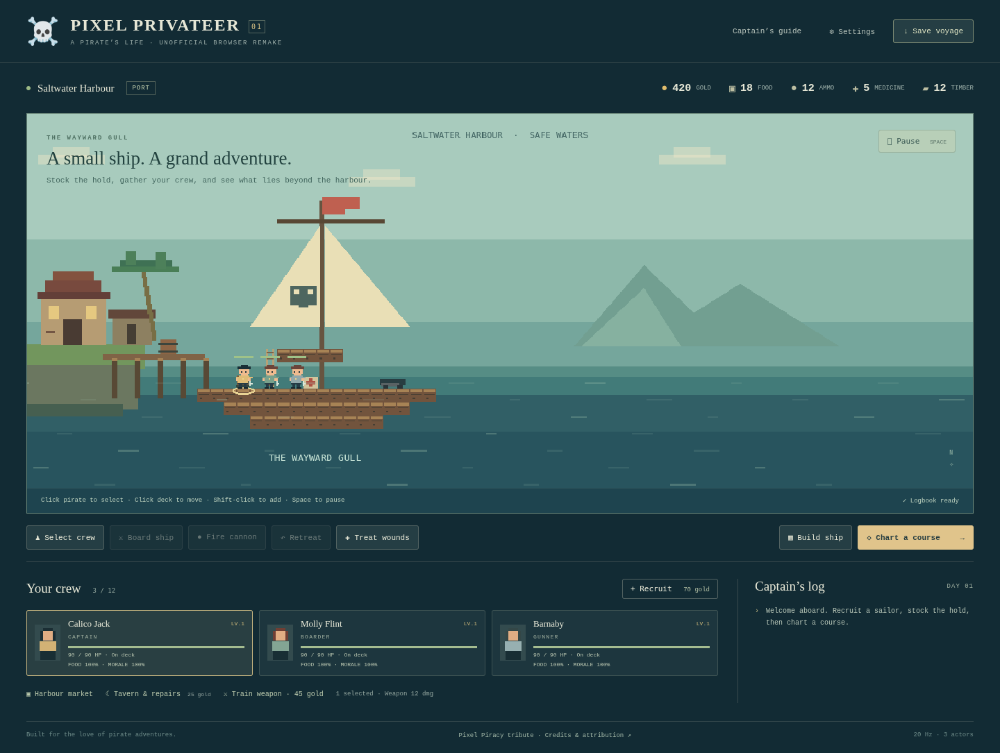

# Pixel Privateer

A playable, unofficial browser tribute to Pixel Piracy: build a ship, hire and equip a crew, chart an expedition, fire cannons, board enemy vessels, collect loot, and return to port. Working repository name: `pirate-crew-web`.

The user's intended use is personal, with any sharing free/noncommercial and properly attributed. This build uses newly drawn procedural pixel art; no Steam assets or reference-game code are included.



## Run locally

Requires Node.js 22.12+ (tested with Node 24) and a current desktop browser with WebGL, IndexedDB, and Web Locks.

```sh
npm ci
npm run dev
```

Open **http://localhost:5173**. Use a local HTTP server or HTTPS; opening `index.html` directly as a file does not provide the required browser storage/lock environment.

```sh
npm test             # headless simulation, save, navigation, and lifetime scenarios
npm run build        # typecheck and production bundle
npm run format:check # source formatting
npm run test:browser # integration + lifecycle checks; start dev server first
```

The browser script uses `/usr/bin/chromium` by default. Set `CHROMIUM_PATH` to another Chromium executable and `GAME_URL` to another dev-server URL if needed. It requires the development build's diagnostic hook; that hook is removed from production.

For a production preview, run `npx vite preview --host 0.0.0.0`. Production output is the static `dist/` directory. The Phaser vendor bundle is separate so gameplay updates can reuse the browser's engine cache.

## GitHub Pages

The game is a static SPA, ready for GitHub Pages. No backend, server rendering, or accounts are needed. Relative asset URLs support both a repository subpath and a custom domain. Menus stay within the page, so no server-side route rewrites are required.

The source is published at [karmiphuc/pirate-crew-web](https://github.com/karmiphuc/pirate-crew-web). The [Pages workflow](.github/workflows/pages.yml) validates, builds, and deploys `dist/` on pushes to `main`. Enable **Settings → Pages → Source → GitHub Actions**; the connected integration cannot change that setting. See [hosting setup and limitations](docs/github-pages.md). A live site is not claimed until deployment succeeds.

Run `npm run build && npm run test:hosting` to test the production bundle at both `/` and `/pirate-crew-web/` using a strict static server. This checks asset requests, game startup, save reload, and the chart without the development diagnostic hook.

## Play

- Recruit at the harbour, buy provisions in the market, and rest at the tavern to heal and repair.
- **Build ship**: click the grid to add/remove hull or ladder parts; apply only a connected, reachable refit. Changes consume timber atomically.
- **Chart a course**: select a location, inspect food/wages, then set sail. Castaway Cay is a safe first treasure stop; the Crooked Cutlass is the easiest ship battle.
- Click a pirate or crew card to select. Shift-click adds/removes canvas pirates. Click a deck to move, or an enemy to attack. **Select crew → Board ship** sends the whole crew across.
- **Fire cannon** needs ammunition and a ready pirate aboard your ship. **Treat wounds** consumes medicine. Return survivors with **Retreat**, then **Break off** to escape without loot.
- **Space** pauses. Movement/boarding orders can be queued while paused; cannon fire and battle healing require resume. **Escape** closes a panel or toggles pause.
- Victory brings gold, timber, ammunition, and crew experience. Return to port, train weapons, and prepare for Admiral Blackthorn.
- Checkpoints save at purchases, departure, and victory. Captain death offers the living departure checkpoint. Settings provides restore, previous checkpoint, export/import, and reduced motion.

Only one browser tab can own writable save state. Backgrounding pauses the voyage. A failed purchase save rolls back the purchase; a failed departure save blocks sailing. Export a backup before clearing browser storage.

## Current scope

One harbour, seven map locations, three pirate ship encounters, two treasure stops, one boss, up to twelve allied pirates, hunger/morale, supplies, wages, leveling, cannon fire, melee/pistol combat, pause, refitting, escape, and local saves.

This is the first playable implementation, not a feature-complete recreation. Islands currently resolve as treasure stops; ship hull damage, station work AI, physical boarding ropes, full equipment inventories, sound/music, ship capture, and pets are not implemented. The ship hull is editable in port; cannon damage currently targets crew. AI movement uses an explicit deck/ladder graph rather than physics. Balance remains provisional.

## Robustness and verification

Simulation is renderer-independent, seeded, and fixed at 20 Hz with bounded catch-up and search work. Explicit application/scene/encounter cleanup, capped collections, immutable checkpoint capture, ordered IndexedDB writes, input backpressure, stale-callback checks, and exclusive writable-tab ownership are in place.

See [implementation and measured checks](docs/implementation-status.md), [design/spec index](docs/README.md), [performance contract](docs/specs/performance-and-lifecycle.md), and [attribution](docs/attribution.md). Runtime checks are scoped evidence, not a guarantee of leak-free behavior on every device.

No distribution license for project code/assets has been selected; free/noncommercial intent is recorded separately from third-party permissions.
