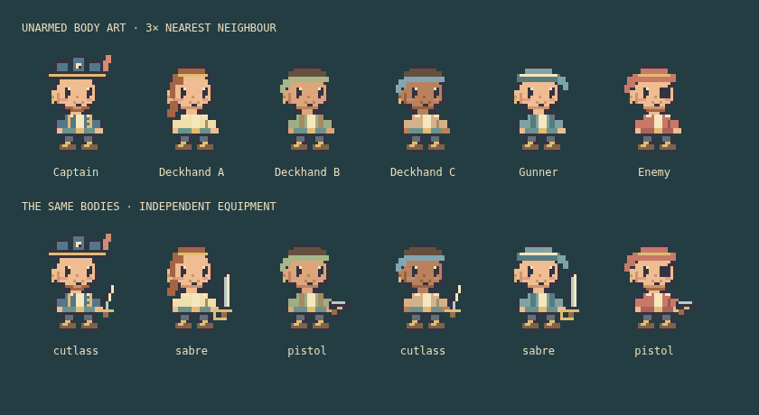
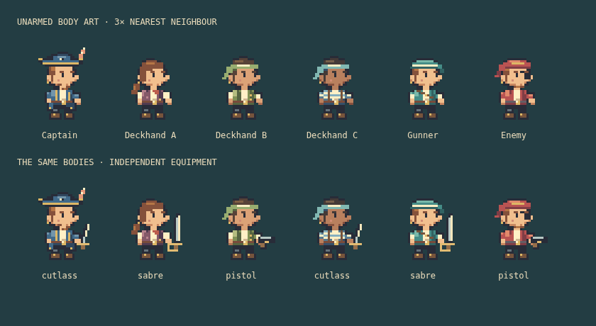

# Crew silhouette redraw

Version 0.7.1, 2026-10-07. The user rejected the preceding iteration as insufficiently attractive and insufficiently close to the intended character style. Passing technical checks is not an art acceptance gate.

## Captured baseline and changes

Fresh Chromium captures of the six-character roster and actual shared textures exposed the remaining problems: a captain hat shaped like three towers, broad blank faces, almost identical square jackets, block-like boots, and nearly symmetrical poses. Revisited Kairosoft’s official [High Sea Saga DX screenshots](https://store.steampowered.com/app/2431880/High_Sea_Saga_DX/); compact facial marks and distinct costumes inform this original redraw. No screenshot assets are included or traced.

The new source art has a stepped tricorn with a sloped brim, smaller three-quarter faces with tiny eyes and a nose silhouette, tapered chins, hair fringes and ponytails, fitted coats and narrow boots. Costume treatments now differ: captain coat tails and brass trim, a plum waistcoat with cream blouse, olive vest, blue striped shirt with suspenders, gunner rolled sleeves and a cross-body strap, and enemy scarf/patch. The walk frame plants one boot and lifts the other heel. Weapons remain separate and driven by equipment.

The first redraw still used repeated jackets; the second changed clothing structure and hair clusters. Both enlarged runtime art and the full harbour/roster screen were inspected. This remains an original side-view interpretation, not a claim of matching Kairosoft quality or the original Pixel Piracy art.

## Presentation and movement corrections

The previous 46 × 58 portrait resized a 32 × 40 frame unevenly; mobile reduced the visible width to 30 without resizing the texture layers, clipping the character’s right side and held item. New portraits use 64 × 80 at desktop (2×), 32 × 40 in compact two-column layouts (1×), and 64 × 80 in the phone’s single-column layout (2×), with matching whole-pixel atlas offsets for body and equipment. The desktop roster uses wider cards so status and food/morale lines remain readable. At phone widths it uses one column, preserving readable text alongside the enlarged character.

Actors retain their last horizontal facing when idle. Movement and a living combat target can update facing; the independently held item mirrors the body. This uses the existing sprite state and does not add saved animation state or a per-actor direction cache.

## Evidence and limits

All drawing remains integer-coordinate raster rectangles with opaque/transparent alpha. Four 96 × 120 body atlases and one 96 × 40 equipment atlas are unchanged in size and count. No new texture, timer, subscription, render object, simulation field or save-schema change is introduced. Browser checks cover left movement → idle → right movement, matching body/item facing, and exact portrait/layer dimensions at desktop, compact and phone sizes, plus phone page overflow. The existing expedition, resource-lifetime and context tests still apply. Measured results are recorded in [implementation status](../implementation-status.md).

The foreground still has only idle/walk/blink frames; attack, hurt and death poses remain absent. Crew at native game scale are small against the detailed backdrop. Taste and character appeal require continued visual review; automated tests cannot certify either.
