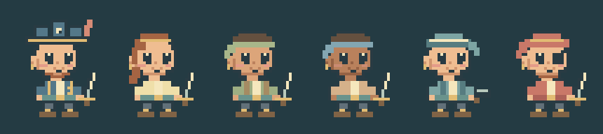

# Cute pixel crew — 0.6.2

2026-10-07. User direction: make the crew cuter and keep refining. The accepted scenic background and the strict raster pixel style remain the target. This is original project art, not imported Steam material or a claim of perfect reference-game fidelity.

## Iteration and visual checks

The earlier profiles were upright and stern, with relatively small faces, straight jaw lines and long bodies. The first new pass made faces larger, bodies shorter, colours softer, cheeks rosy and boots more compact. Enlarged source previews and a six-crew harbour capture still showed square jaws and blank expressions. A second pass stepped in the cheek/jaw corners, enlarged eye highlights and added a one-pixel walk bounce. The final pass clarified the small smile and added a staggered idle blink.

This proof is captured from the real game's shared texture sources, enlarged 4× with nearest-neighbour scaling. It shows the captain, three deckhand appearances, gunner and enemy. The artwork was also inspected in the actual harbour and matching roster portraits. Cute appearance is a design judgment; no user acceptance or universal perfection is claimed. The game still has limited character animation and a small canvas at phone widths.

## Resource and interaction decisions

Character drawing still uses only integer raster rectangles. Four shared 96 × 120 atlases each contain three appearance rows and idle/walk/blink columns; nine frames per atlas. Compared with 0.6.1, decoded RGBA storage increases by 60 KiB in total. Eight total Phaser textures remain expected. Portraits select the same appearance row from the idle column and use nearest-neighbour scaling.

The walk bounce is drawn into the shared frame, not implemented with a tween or timer. Idle blinks use `(tick + pirateId × 11) modulo 110 < 3`: three simulation ticks approximately every 5.5 seconds while stationary. The simulation's existing clock drives visual timing; pause freezes it. Reduced motion disables the walk alternation and idle blink. The extra frame uses the existing application-owned atlases and preallocated frame names, with no new per-actor cache or subscription. Neither the simulation nor save schema changes.

## Verification

The browser harness verifies opaque/transparent source pixels, atlas size/frame counts, idle blink selection, reduced-motion suppression, texture/subscription stability across restarts and encounters, full gameplay/save recovery and final disposal. The 92 simulation/storage tests, formatting, TypeScript/build and root/project-path production hosting checks also run. Exact scoped results are recorded in [the runtime report](../validation-results.json). Hardware frame rate and a 30-minute ordinary-GC soak remain unverified.
