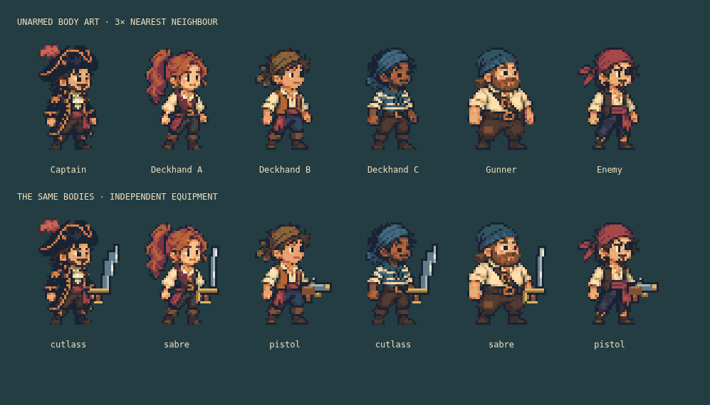
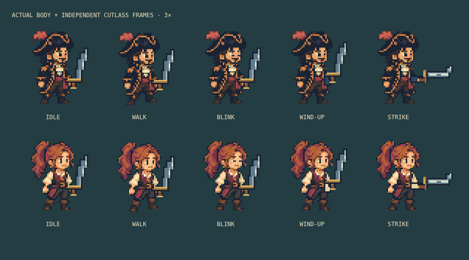

# Character art and combat poses

Version 0.8.0, 2026-10-07. The user rejected the previous incremental redraw and asked for a stronger visual result. This pass replaces the character source art and adds combat poses.

## Original source and runtime result

Created an original six-character, unarmed design sheet using OpenAI Image Gen. The brief asked for charming compact pixel pirates informed by Kairosoft readability, with distinctive tricorn, ponytail, olive scarf, striped sailor shirt, stout gunner and red-bandana enemy. No game screenshot, Steam asset, or third-party character sheet was supplied to the generation tool. The complete source PNG is preserved unchanged in [the game assets](../../src/game/assets/crew-source.png), alongside the original generated file in the workspace.

The source illustration is not a native low-resolution atlas. Startup draws six selected source regions into 40 × 56 cells without smoothing, thresholds alpha to transparent/opaque, and maps colours to a fixed 38-colour palette. Animation frames are built from those cells, retaining the faces and costumes. This turns the original illustration into actual hard-edged pixel sprites; it is not merely a concept image shown beside the application.

Native 40 × 56 actor frames are larger than the previous 32 × 40 frames. Portraits use 2× scale on desktop/phone and 1× in compact two-column layouts. Click height and health-bar placement follow the taller silhouette. Known roster identities select matching appearance families, with deterministic ID-derived variants for other names; appearance remains derived rather than adding a save field.

## Independent equipment and combat

Every body source is unarmed. Hand anchors differ between the six designs; the scene and roster apply the corresponding item offset. The portrait permits the wider transparent item layer to extend into its reserved gutter, so a pistol barrel is not cropped at the body-frame edge. Equipment has its own atlas and sprite. The wider transparent item frame gives a forward sword swing space beyond the body. Cutlass, sabre and flintlock use distinct original pixel art and independent idle/ready/attack frames. Idle blades measure 23 and 22 native pixels from the hand, and stay below the hat; the pistol is 15 pixels wide. Curved steel, selective highlights, brass guards and walnut grips give the items their own material detail. Portraits reserve a 24-pixel gutter for the transparent equipment layer.

Wind-up and strike poses follow authoritative combat status and cooldown, not a separate animation timer. The first three ticks after an attack show a strike; the final three ticks before another attack show preparation while a living target remains. Port state suppresses stale combat status, paused renders hold their pose, and reduced motion disables pose cycling and muzzle flashes. A brief pistol muzzle mark is drawn in the existing overlay during the actual attack tick. Combat damage, range, cooldown rules, navigation and schema 4 are unchanged. Hurt and death animations remain absent.

## Bounded startup and resource ownership

The 2172 × 724 source PNG is 1,273,328 bytes; decoded source RGBA is about 6 MiB before browser decoder overhead. It is loaded only when a body atlas needs creation. The loader puts one HTML image into an application-owned CPU cache instead of creating a Phaser texture for it. Conversion removes that cache entry; browsers may retain their own decoded image or asset cache. The 2172-pixel-wide source never requires a large GPU texture. Six temporary 40 × 56 canvases belong to startup and are not held by scene state.

Four shared 200 × 168 body atlases contain fifteen frames each. The shared 288 × 168 equipment atlas contains nine frames of 96 × 56. Together their decoded RGBA pixels occupy 714 KiB, an increase of 519 KiB over 0.7.1. Nine global textures, one body plus one item per living actor, existing crew limits, and four scene subscriptions remain. No per-frame texture generation, tween, particle pool, timer, or animation-state cache is introduced. Existing scene/app disposal releases actor and item views and portrait CSS properties.

If a required artwork request fails, the scene shows a reload message, gameplay stays stopped, and the checkpoint is preserved. Help/settings/export remain available. Reload retries the asset and rebuilds the atlas. The scene installs its teardown handlers even on this failure path.

## Verification

Inspected the source illustration, enlarged actual runtime bodies/items, all five captain/deckhand poses, full harbour/roster, and phone views. The final weapon refinement curves the cutlass blade and keeps every item drawing operation inside its frame; the phone roster uses normal page scrolling so cards are not cut in half by an internal height limit.

Browser checks validate hard alpha, atlas dimensions/frame counts, source-image release, equipment drawing bounds, cooldown/pose relationships, pause, reduced motion, facing, portrait geometry, failed crew/background image requests, immediate CPU-source cleanup, and successful checkpoint reload. Existing 100 panel cycles, ten scene restarts, fifty rendered encounters, context recovery, save-failure rollback and final disposal checks still apply. Latest measured results are in [implementation status](../implementation-status.md) and [the report](../validation-results.json). Taste is evaluated from captures rather than inferred from test success; a faithful reproduction of either reference game's art is not claimed.
