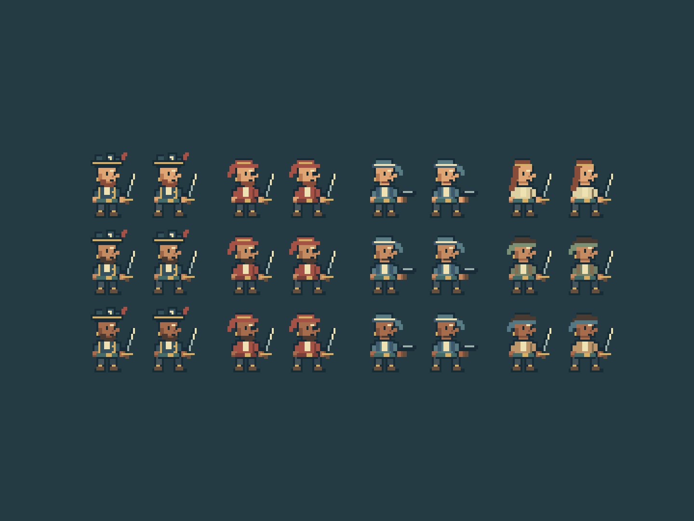

# Pixel crew correction — 0.6.1

2026-10-07. User feedback: the background works, but the soft outlined pawns are ugly and must fit a pixel style. This revision replaces character art rather than changing the accepted backdrop.

All character drawing now uses integer-coordinate raster rectangles. Curves, antialiased polygon outlines, fractional coordinates and rounded face shapes are removed. Stepped hats, compact profiles, a short beard, narrow coats, weight-bearing boots and pixel cutlasses define the silhouettes. The original shared appearance variants remain; no Steam art is imported.

The preview is captured from the running game's four texture sources, including idle/walk frames and three appearance rows. It is an art proof, not a gameplay screen or reference-game sprite sheet. In-game actors use native 1× source scale rather than 1.35×; roster portraits use pixelated image rendering. Responsive whole-canvas scaling can still change apparent pixel size at arbitrary viewport widths. Health bars and selection rings sit closer to the smaller bodies; click targets follow their height while retaining horizontal input tolerance.

Four 64 × 120 atlases and eight total textures are retained. Source painting occurs only during atlas creation; frame names remain preallocated, and scenery/simulation/save schema are unchanged. The original coastal backdrop remains untouched. The game is still a work in progress, not a verified 1:1 recreation.

All 92 tests, formatting/build and production root/project-path checks pass. Browser integration checks that every atlas alpha byte is 0 or 255, each atlas has six frames, and restart/encounter texture counts remain stable. Full expedition, storage, context recovery, 100 panel cycles, ten restarts, 50 encounters and disposal pass with no page errors. Runtime results are in [the report](../validation-results.json); software-rendered timings do not establish 60 FPS on hardware.
