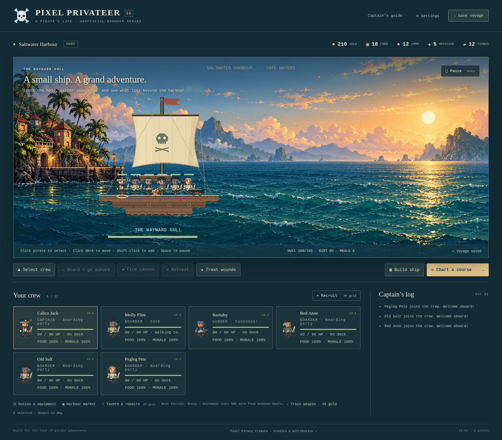
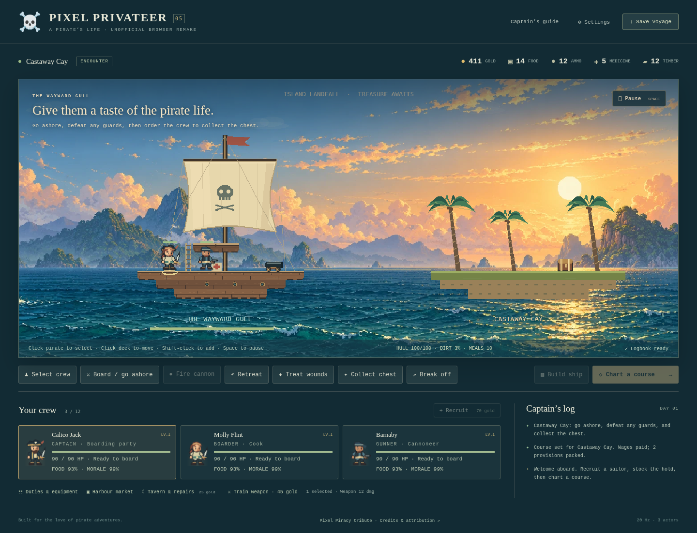
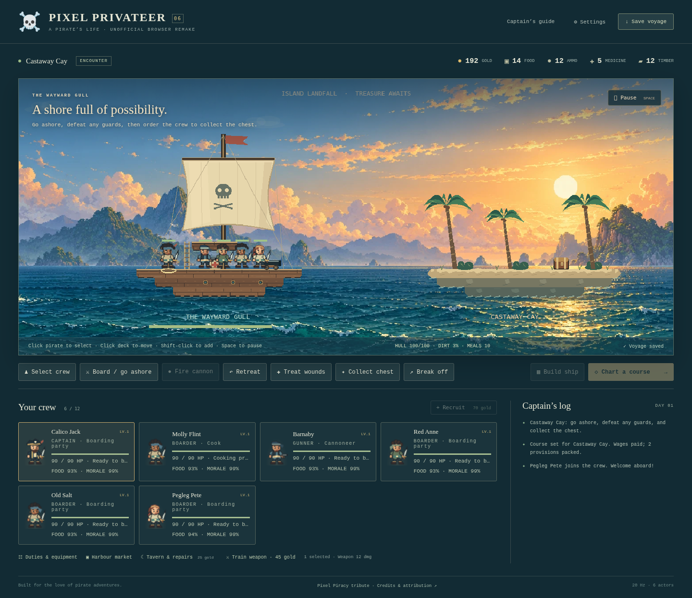
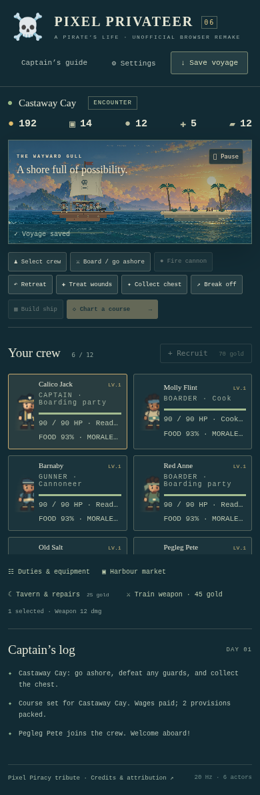

# Visual refinement — version 0.6

2026-10-07. Existing playable game reviewed and refined with the Product Design guidance. The plugin cloud browser is unavailable; the project's Chromium/Playwright tools captured current screenshots. This is a visual review of the implemented game, not a full accessibility certification or reference-game fidelity claim.

## Steps and findings

1. **Harbour and recruitment — improved.** The v0.5 capture showed repeated faces, a flat supply barrel and medical box, and weak contact between hull and sea. Three deterministic appearance variants now distinguish non-captain crew through hair, scarf, skin and coat colours. Portraits select the same atlas row as their actor and stay consistent after checkpoint reload. Rounded barrel staves/hoops and a strapped medical case replace square station placeholders. Restrained contact shadows and broken foam lines help seat the ship in the water. A taller scrollable roster shows two full desktop rows.

2. **Island arrival — improved, still simplified.** The fresh pre-change capture shows a repeating green cap and rectangular sand blocks. The new foreground has a warm sandy lip, bevelled rock edges, sparse grass and shrubs, and foam along actual lower edges. Decoration does not connect missing support cells. The island has its own arrival headline. Foreground contours remain based on the game's grid; broad terrain variety and richer animation are still outstanding.

3. **Compact layout — usable with limits.** Fresh 700- and 390-pixel captures have no horizontal overflow. Controls wrap and the roster scrolls. At phone width, long status text truncates and the scaled game canvas is small; this does not establish good touch targeting or accessibility. A dedicated mobile camera/input treatment remains a future task. Colour/contrast and screen-reader coverage need separate testing.

## Robustness and performance decisions

Four shared 64 × 120 atlases contain three rows of idle/walk frames, replacing four 64 × 40 atlases. Additional decoded RGBA storage is approximately 80 KiB; texture count remains eight including the existing environment and Phaser built-ins. Variants derive from existing pirate IDs, with a fixed captain appearance, requiring no save migration or additional RNG draws. Portraits reuse the same scene-owned CSS atlas bindings and release them on shutdown.

Static shoreline, contact shadow, foam and station props redraw only on relevant scene revisions. Adjacency checks reuse a bounded occupied-cell set; no additional world cache, particle emitter, object pool or animation timer exists. Animation selects preallocated frame names and changes a sprite's frame only when needed, avoiding frame-name construction on every actor update.

All 92 tests, formatting and production build pass. Full browser integration passed 100 panel cycles, ten scene restarts, 50 rendered encounters, context recovery, storage rollback and disposal. The full run preceded only the final preallocated-frame lookup change; [the final renderer check](final-render-check.json) verifies all three appearance rows, ten further restarts, six actors, unchanged eight textures/four subscriptions, compact widths and disposal with no page errors. Final production hosting checks cover root and repository paths. The [runtime sample](../validation-results.json) records software rendering; it does not establish 60 FPS on hardware or a 30-minute ordinary-GC soak.

All changed foreground and character artwork is authored in project code. The v0.5 backdrop and its recorded generation provenance are unchanged. No reference-game assets were imported.
