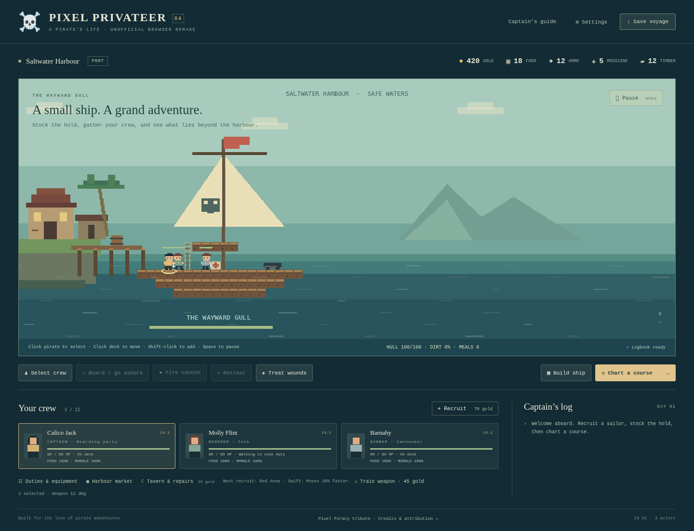
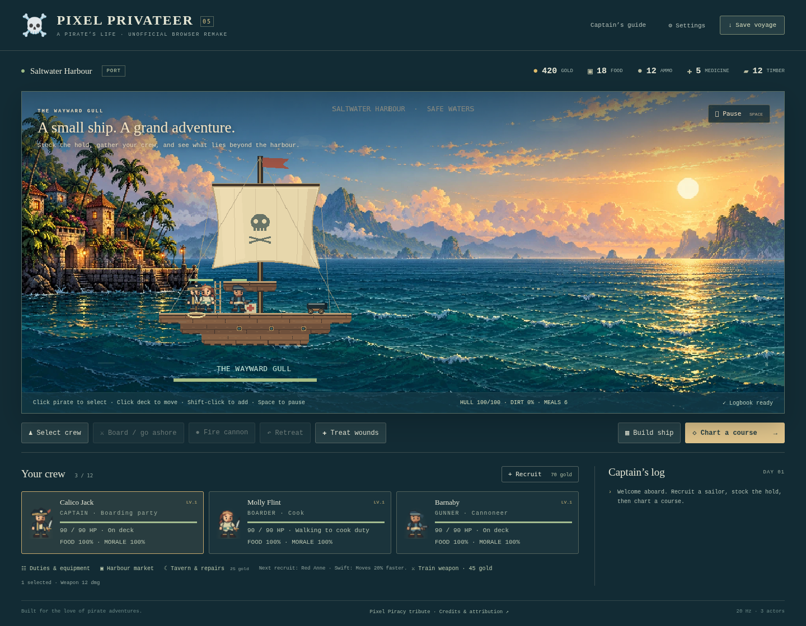
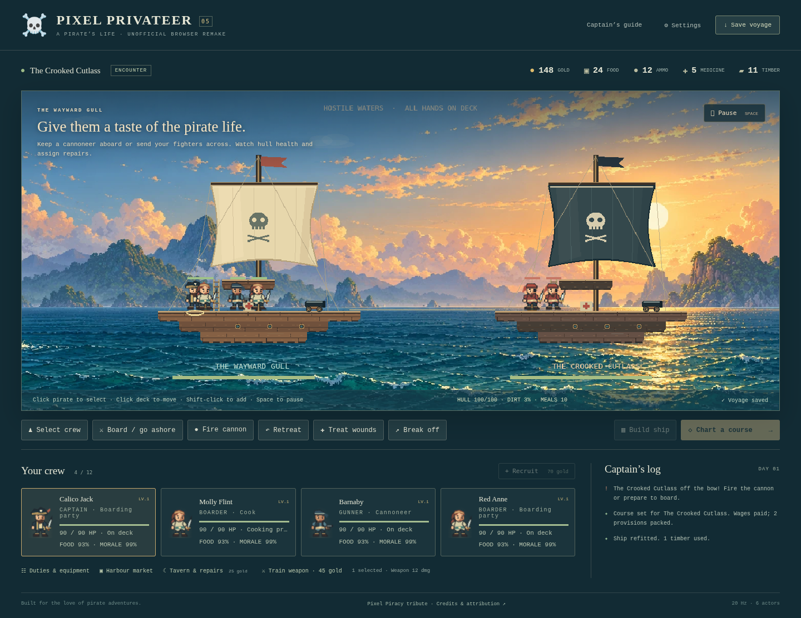
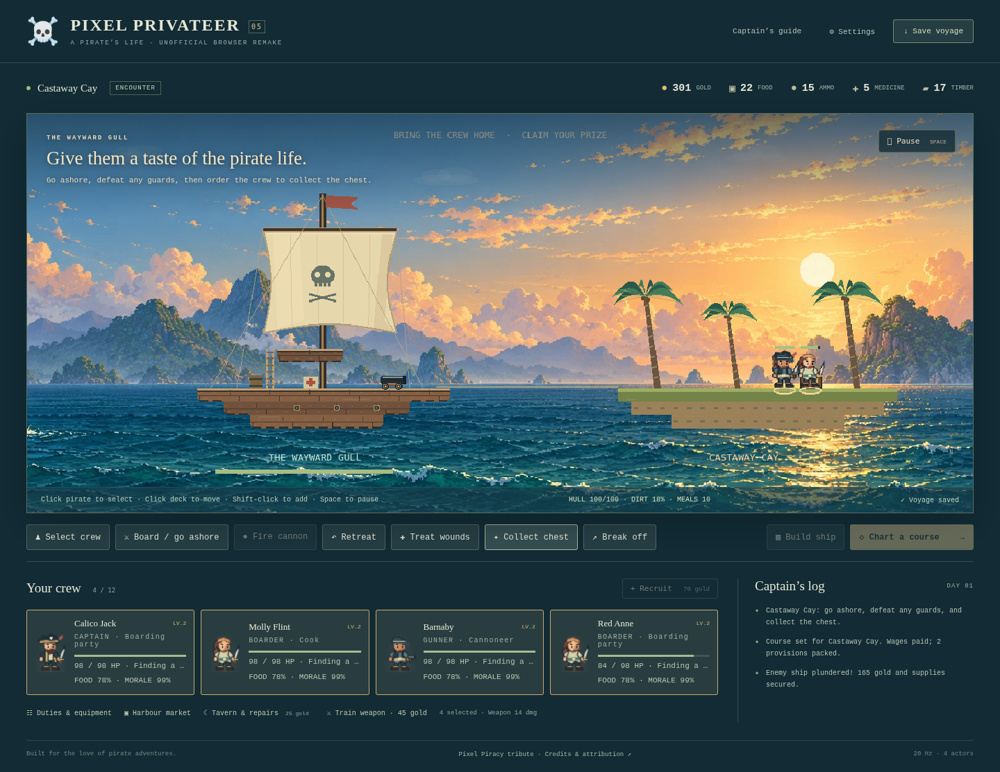

# Visual overhaul — version 0.5

Date: 2026-10-07. Scope: the existing playable harbour, ships, crew, battle and island views. Review uses screenshots captured from the actual Chromium/WebGL game, not a concept render. The Product Design plugin browser integration was unavailable, so the project Playwright tools supplied the evidence.

## Direction

Warm coastal adventure: ink-dark teal interfaces, ivory cloth, weathered timber, restrained brass accents, golden distant light, and compact expressive pirates. Character silhouettes and equipment carry role identity; a scenic backdrop gives depth without adding objects to the simulation. Ship deck positions continue to match playable tiles.

## Evidence

The earlier characters had the same square heads and bodies, repeated exposed tile borders and flat sails. The new crew has shaped hats, brows, beards, fitted clothing, boots and weapons, with matching roster portraits. Cloth contours and seams, mast lighting, rigging, planking and cannon wheels give ships clearer material and depth. Palms have bent trunks and tapered fronds. Harbour scenery switches to an open-sea crop in encounters.

Text over scenery has a subtle dark scrim and shadow. Crew details and action labels are larger. These changes improve readability; a full accessibility audit and hardware/browser matrix remain outstanding. Island shore outlines, station props and two-frame animation remain visibly simpler than the backdrop. This is original project art and does not establish full reference-game fidelity.

The compact layout hides the long control hint, keeping hull/supplies and save status on one line. [700-pixel capture](../images/visual-compact.png).

## Backdrop generation brief and transformation

Generated using OpenAI Image Gen on 2026-10-07. Requested a panoramic pixel-painted coastal sea at warm golden hour, a distant harbour at far left, layered blue-green islands, atmospheric clouds and textured sea reflections, with no UI, characters or foreground ships. No reference-game image or extracted assets were supplied. The resulting original image is 1931 × 813 pixels. It was encoded into WebP without resizing or retouching; a cropped frame excludes the harbour during travel/battle/island scenes. The four small character atlases and ship/island foregrounds are authored in project code.

## Verification

The production artifact passes both root and repository-subpath hosting checks. Browser integration exercises visible combat, island landing, collection and return as well as texture/subscription stability, context restoration and application disposal. Exact results are recorded in [the runtime report](../validation-results.json). All 92 tests pass, along with 100 panel cycles, 10 scene restarts and 50 rendered encounters. Texture count remains eight and listener count remains 75. A 700-pixel viewport has no horizontal overflow. The headless software-rendered frame p95 is 43.33 ms; this does not meet or prove a 60 FPS hardware target.
