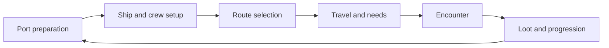

# Proposed game design

## Player promise

Turn a small vessel and a handful of pirates into a crew and ship worth risking. Every expedition asks how far to travel, whom to send into danger, and what to bring home.

Desktop players who enjoy crew management, tactical pause, and expressive construction are the initial audience. Sessions should support a short encounter or a longer voyage, with resumption from a safe checkpoint.

## Design pillars

1. **Reliable crew:** orders succeed or produce a specific reason they cannot.
2. **Useful layouts:** station access, firing positions, and retreat routes affect outcomes.
3. **Preparation matters:** recruits and equipment increase capability and operating costs.
4. **Readable risk:** players can assess known threats and supply needs before committing.
5. **Character attachment:** names, traits, roles, and survival make pirates memorable.

## Core loop

Recruit/resupply → build/equip → choose route → manage travel → fight/explore → loot/progress → return and improve.

## Presentation

Side-view pixel-art ships and islands; a separate world map; crisp sprites; readable interface text; visible crew tasks and health feedback. Use original pirate humor without letting decorative debris become unbounded simulation objects.

## Tactical direction

Real-time combat with pause and queued commands. Individual selection and named squads. Crew roles change behavior: boarder, ranged fighter, gunner, medic, repairer. The initial combat build delivers boarders and ranged fighters first, then the support stations needed by the slice.

Layout tradeoffs should be visible. A nearby medical station shortens retreats; cannons consume crew and space; exposed firing positions offer clear shots but vulnerability. Initial seaworthiness is abstract, not simulated buoyancy.

## Progression and failure

Earn gold, parts, equipment, and experience through expeditions. Start with a single region and one boss. Standard mode reloads a safe checkpoint after captain death; hardcore mode is deferred. Crew deaths during successful encounters persist. Avoid permanent account upgrades in the MVP.

## Proposed later extensions

Additional regions, factions, negotiation, surrender, rescue missions, ship capture, pets, tablet controls, and optional cloud saves. Each needs its own scope decision. Multiplayer requires a separate architecture and is outside the initial roadmap.

## Success signal

An unfamiliar player completes the first expedition, understands why at least one command failed or succeeded, and chooses an upgrade that changes the next voyage. Validate this before expanding content.

## Usage and fidelity intent

The user requests a personal-use remake with free/noncommercial sharing and proper attribution. Use the reference game as the gameplay target while retaining the documented robustness improvements. Record any intentional departures and verify closer fidelity against a named build. Credits and material permissions are tracked in [attribution](attribution.md).
